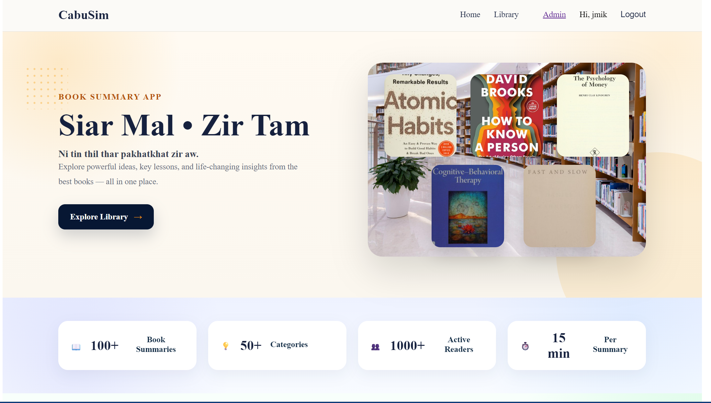
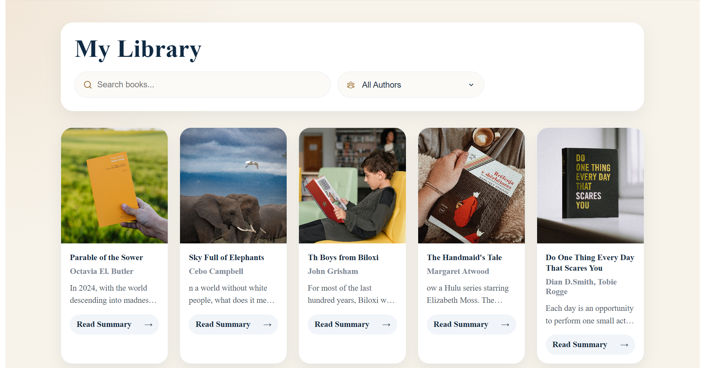
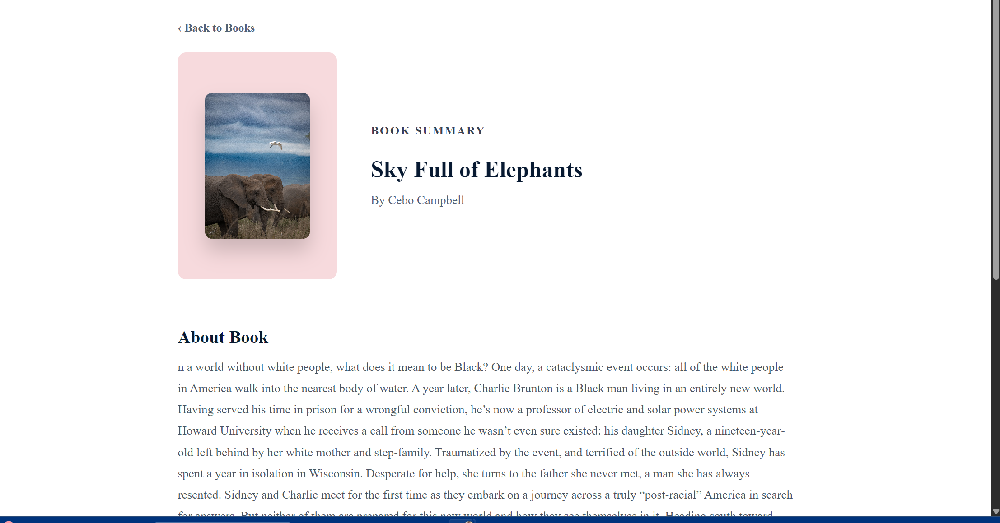
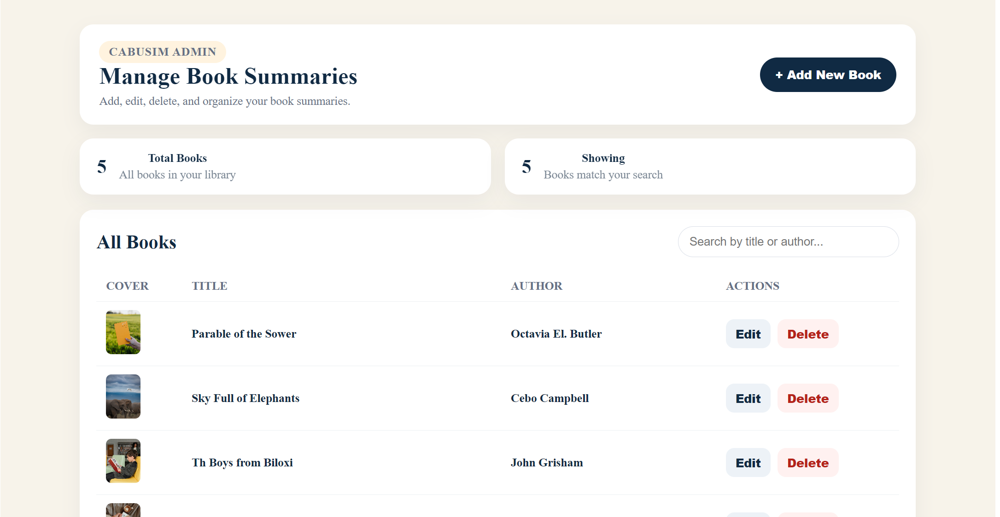

# 📚 CabuSim - Book Summary App

A full-stack web application that helps users discover books, read summaries, and share their thoughts through comments. The application includes secure authentication, an administrator dashboard, and a responsive user interface.

## 🌐 Live Demo

🔗https://book-summary-app-qn7c.onrender.com


---

## 📸 Screenshots

### Home Page



### Library



### Book Details



### Admin Dashboard



> Create a folder named `screenshots` inside `src/assets` (or use an `images` folder in the root) and save your screenshots there.

---

## ✨ Features

- 🔐 User Authentication
- 🔑 Google OAuth Login
- 📚 Browse Book Collection
- 🔍 Search Books
- 📝 Read Book Summaries
- 💬 Comment on Books
- 👨‍💼 Admin Dashboard
- ➕ Add New Books
- ✏️ Edit Books
- 🗑️ Delete Books
- 🖼️ Upload Book Covers
- 📱 Responsive Design

---

## 🛠️ Built With

- React
- Vite
- JavaScript
- React Router
- CSS
- Google OAuth
- REST API

---

## ⚙️ Getting Started

### Clone the repository

```bash
git clone https://github.com/JMIK-THANG/book-summary-app.git
```

### Install dependencies

```bash
npm install
```

### Create a `.env` file

```env
VITE_BACKEND_URL=your_backend_url
VITE_GOOGLE_CLIENT_ID=your_google_client_id
```

### Start the development server

```bash
npm run dev
```

---

## 🔗 Backend Repository

https://github.com/JMIK-THANG/book-summary-app-backend

---

## 🚀 Future Improvements

- ❤️ Favorite Books
- ⭐ Book Ratings
- 🌙 Dark Mode
- 📖 Reading History
- 🔔 Notifications
- 🧪 Unit Testing

---

## 👨‍💻 Author

**Jmik Thang**

GitHub: https://github.com/JMIK-THANG
